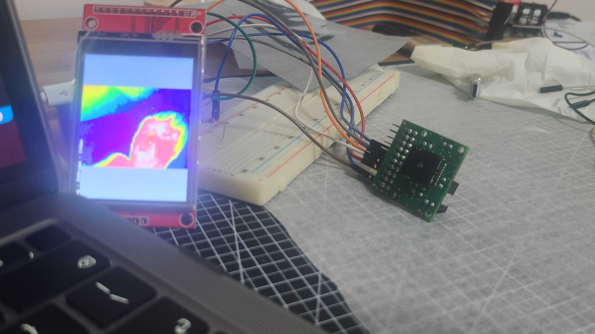
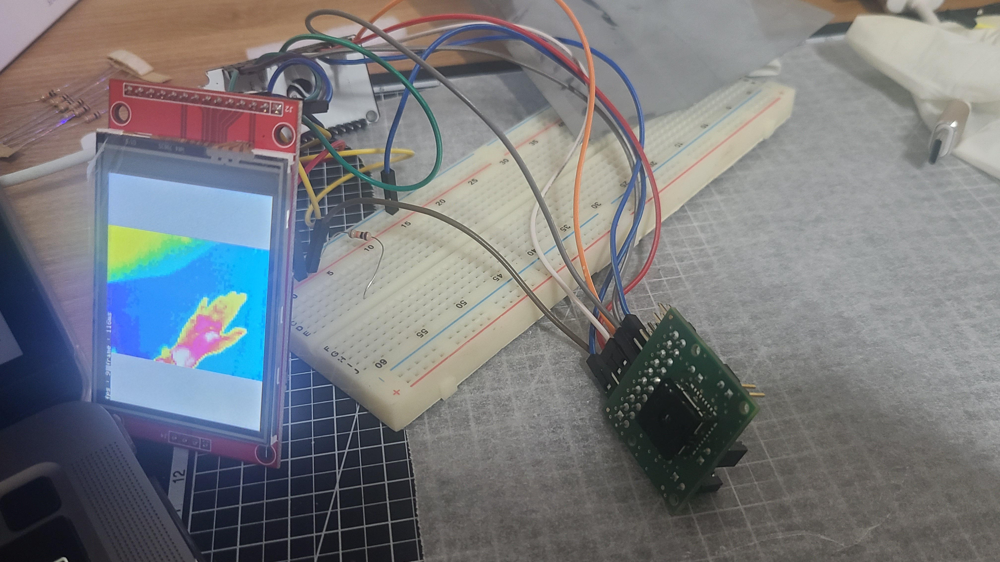

# ThremalScope
ESP32 + Lepton based Toy Thermal Scope Project

# Pinmap
 
/* Lepton Pinmap
 * Lepton         ESP32
 * SDA        ->  21
 * SCL        ->  22
 * CS         ->  5
 * CLK(SCK)   ->  18
 * MISO       ->  19
 * MOSI       ->  23
 */

/* ILI9341 320x240 tft LCD Pinmap (HSPI)
 * LCD            ESP32
 * CS         ->  15
 * RESET      ->  4
 * DC         ->  2
 * SDI(MOSI)  ->  13
 * CLK(SCK)   ->  14
 * LED        ->  VCC
 * SDOK(MISO) ->  12
 * T_CLK      ->  SCK
 * T_CS       ->  34
 * T_DIN      ->  MOSI
 * T_DO       ->  MISO

# Legal Compliance in Korea
이 프로젝트는 레저용 장난감(에어소프건) 용도로 개발되었습니다.

프로젝트 내에선 영점조절 기능이 사용 불가능하도록 처리되어 있습니다.

한국에서 본 프로젝트의 영점조절 기능을 구현 할 경우 조준경(총포 부품) 해석될 수 있음을 알립니다.

[총포ㆍ도검ㆍ화약류 등의 안전관리에 관한 법률 시행령](https://www.law.go.kr/%EB%B2%95%EB%A0%B9/%EC%B4%9D%ED%8F%AC%E3%86%8D%EB%8F%84%EA%B2%80%E3%86%8D%ED%99%94%EC%95%BD%EB%A5%98%EB%93%B1%EC%9D%98%EC%95%88%EC%A0%84%EA%B4%80%EB%A6%AC%EC%97%90%EA%B4%80%ED%95%9C%EB%B2%95%EB%A5%A0%EC%8B%9C%ED%96%89%EB%A0%B9)
